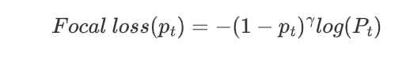

# 分类损失函数

  
Cross Entropy

  <h2>1. 损失函数介绍</h2>
  <h2>2. 表达式</h2>

  
Focal Loss

  <h2>1. 损失函数介绍</h2>
      Focal Loss是用于分类问题的带参损失函数, 当前object detection算法：
      1. two-stage detector: Faster-RCNN为代表，需要region proposal的算法，由于RPN需要对object进行两次过滤(2-stage)，准确率较高但速度慢
      2. one-stage detector: YOLO为代表，速度快准确率不高
      Focal loss 的目的是让one-stage在维持速度的前提下达到two-stage准确率。作者认为one-stage准确率不佳的核心原因：样本类别不均衡。Focal Loss采用调制因子来减少易分类样本的权重，从而使得模型在训练时更专注于难分类的样本。
  <h2>2. 表达式</h2>
     focal Loss 定义如下:
     
  <h2>3. 代码实现</h2>
     Focal损失函数的Python代码
    <pre>
       class FocalLoss(nn.Module):
          def __init__(self, gamma=0,alpha=1):
              super(FocalLoss, self).__init__()
              self.gamma = gamma
              self.ce = nn.CrossEntropyLoss()
              self.alpha=alpha
          def forward(self, input, target):
              logp = self.ce(input, target)
              p = torch.exp(-logp)
              loss = (1 - p) ** self.gamma * logp
              loss = self.alpha*loss
              return loss.mean()
    <\pre>

  
Hinge Loss

  <h2>1. 损失函数介绍</h2>
      用于2分类问题的不带参损失函数，标签值$y$的取值$\pm1$, 预测值$\hat{y} \in R$, 该二分类问题的目标函数的要求：当$\hat{y}$大于等于+1或者小于等于-1时，都是分类器确定的分类结果，此时的损失函数loss为0；而当预测值$\hat{y}$∈(−1,1)时，分类器对分类结果不确定，loss不为0。显然，当$\hat{y}$=0时，loss达到最大值重，从而使得模型在训练时更专注于难分类的样本。
  <h2>2. 表达式</h2>
     focal Loss 定义如下:
     
  <h2>3. 代码实现</h2>
     Focal损失函数的Python代码
    <pre>
       class FocalLoss(nn.Module):
          def __init__(self, gamma=0,alpha=1):
              super(FocalLoss, self).__init__()
              self.gamma = gamma
              self.ce = nn.CrossEntropyLoss()
              self.alpha=alpha
          def forward(self, input, target):
              logp = self.ce(input, target)
              p = torch.exp(-logp)
              loss = (1 - p) ** self.gamma * logp
              loss = self.alpha*loss
              return loss.mean()
    <\pre>

# 回归损失函数

  
Huber loss

  <h2>1. 损失函数介绍</h2>
      Huber Loss 是一个用于回归问题的带参损失函数, 优点是能增强平方误差损失函数(MSE, mean square error)对离群点的鲁棒性。
      当预测偏差小于 δ 时，它采用平方误差,当预测偏差大于 δ 时，采用的线性误差。
      相比于最小二乘的线性回归，HuberLoss降低了对离群点的惩罚程度，所以 HuberLoss 是一种常用的鲁棒的回归损失函数。
  <h2>2. 表达式</h2>
     Huber Loss 定义如下:
     
  <h2>3. 代码实现</h2>
     Huber损失函数的Python代码
    <pre># huber 损失
def huber(true, pred, delta):
    loss = np.where(np.abs(true-pred) < delta , 0.5*((true-pred)**2), delta*np.abs(true - pred) - 0.5*(delta**2))
    return np.sum(loss)</pre>

# 特定任务损失函数

  
Verification loss(Re-ID)

  <h2>1. 损失函数介绍</h2>
  <h2>2. 表达式</h2>

