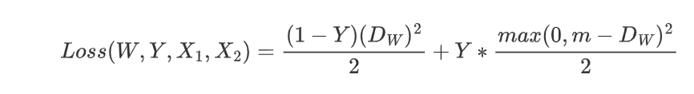

# 分类损失函数

  
Cross Entropy

  <h2>1. 损失函数介绍</h2>
     交叉熵（Cross Entropy）是Shannon信息论中一个重要概念，主要用于度量两个概率分布间的差异性信息。
     交叉熵损失函数用于度量实际输出（概率）与期望输出（概率）的距离，也就是交叉熵的值越小，两个概率分布就越接近。
     交叉熵函数常用于分类(classification)。
  <h2>2. 表达式</h2>
     Cross Entropy Loss 定义如下:
     
  <h2>3. 代码实现</h2>
     Cross Entropy Loss的Python代码
    <pre>
    
    def cross_entropy(a, y):
        return np.sum(np.nan_to_num(-y*np.log(a)-(1-y)*np.log(1-a)))

    # tensorflow version
    loss = tf.reduce_mean(-tf.reduce_sum(y_*tf.log(y), reduction_indices=[1]))

    # numpy version
    loss = np.mean(-np.sum(y_*np.log(y), axis=1))</pre>

  
Focal Loss

  <h2>1. 损失函数介绍</h2>
      Focal Loss是用于分类问题的带参损失函数, 当前object detection算法：
      1. two-stage detector: Faster-RCNN为代表，需要region proposal的算法，由于RPN需要对object进行两次过滤(2-stage)，准确率较高但速度慢
      2. one-stage detector: YOLO为代表，速度快准确率不高
      Focal loss 的目的是让one-stage在维持速度的前提下达到two-stage准确率。作者认为one-stage准确率不佳的核心原因：样本类别不均衡。Focal Loss采用调制因子来减少易分类样本的权重，从而使得模型在训练时更专注于难分类的样本。
  <h2>2. 表达式</h2>
     focal Loss 定义如下:
     
  <h2>3. 代码实现</h2>
     Focal损失函数的Python代码
    <pre>
       class FocalLoss(nn.Module):
          def __init__(self, gamma=0,alpha=1):
              super(FocalLoss, self).__init__()
              self.gamma = gamma
              self.ce = nn.CrossEntropyLoss()
              self.alpha=alpha
          def forward(self, input, target):
              logp = self.ce(input, target)
              p = torch.exp(-logp)
              loss = (1 - p) ** self.gamma * logp
              loss = self.alpha*loss
              return loss.mean()</pre>

  
Hinge Loss

  <h2>1. 损失函数介绍</h2>
      用于2分类问题的不带参损失函数，标签值y的取值+1/-1, 预测值y'∈R, 该二分类问题的目标函数的要求：当y大于等于+1或者小于等于-1时，都是分类器确定的分类结果，此时的损失函数loss为0；而当预测值y'∈(−1,1)时，分类器对分类结果不确定，loss不为0。显然，当y'=0时，loss达到最大值重，从而使得模型在训练时更专注于难分类的样本。
  <h2>2. 表达式</h2>
     Hinge Loss 定义如下:
     
  <h2>3. 代码实现</h2>
     Hinge损失函数的Python代码
    <pre>
       loss = max(0, 1-target*prediction)</pre>

  
Logistic Loss

  <h2>1. 损失函数介绍</h2>
      用于二分类问题的损失函数
  <h2>2. 表达式</h2>
     Logistic Loss 定义如下:
     
  <h2>3. 代码实现</h2>
     Logistic损失函数的Python代码
    <pre>
       loss = 1 / (1 + torch.exp(-x))</pre>

# 回归损失函数

  
Quantile Loss

  <h2>1. 损失函数介绍</h2>
      分位数回归 Quantile Regression 是一类在实际应用中非常有用的回归算法，通常的回归算法是拟合目标值的期望或者中位数，而分位数回归可以通过给定不同的分位点，拟合目标值的不同分位数。
      分位数回归是通过使用分位数损失 Quantile Loss 来实现这一点的，分位数损失形式如下，式中的 r 分位数系数。
     
  <h2>2. 代码实现</h2>
     https://gist.github.com/borgwang/4313e9375ef233c3b812f9f80f1af2bb

  
Huber loss

  <h2>1. 损失函数介绍</h2>
      Huber Loss 是一个用于回归问题的带参损失函数, 优点是能增强平方误差损失函数(MSE, mean square error)对离群点的鲁棒性。
      当预测偏差小于 δ 时，它采用平方误差,当预测偏差大于 δ 时，采用的线性误差。
      相比于最小二乘的线性回归，HuberLoss降低了对离群点的惩罚程度，所以 HuberLoss 是一种常用的鲁棒的回归损失函数。
  <h2>2. 表达式</h2>
     Huber Loss 定义如下:
     
  <h2>3. 代码实现</h2>
     Huber损失函数的Python代码
    <pre># huber 损失
def huber(true, pred, delta):
    loss = np.where(np.abs(true-pred) < delta , 0.5*((true-pred)**2), delta*np.abs(true - pred) - 0.5*(delta**2))
    return np.sum(loss)</pre>

  
L1/L2 loss

  <h2>1. L1-norm loss function</h2>
     
  <h2>2. L2-norm loss function</h2>
     
  <h2>3. L1和L2 损失函数区别</h2>
     L2损失函数是最最常用的损失函数，在回归问题中，也就是我们耳熟能详的最小二乘法。并且在满足高斯马尔可夫条件的时候，可以证明使用L2损失函数所得的参数具有无偏性和有效性。
     但是，L1损失函数也有其自己的优点，下面我们对两个损失函数进行比较。
      
     稳健性:
     L1损失函数稳健性强是它最大的优点。面对误差较大的观测，L1损失函数不容易受到它的影响。这是因为:L1损失函数增加的只是一个误差，而L2损失函数增加的是误差的平方。当误差较大时，使用L2损失函数，我们需要更大程度的调整模型以适应这个观测，所以L2损失函数没有L1损失函数那么稳定。
     那么，当我们认为模型中可能存在异常值时，使用L1损失函数可能会更好；但是，当我们需要把误差较大的观测也纳入模型中时，使用L2损失函数更好一些。
     解的稳定性:
     首先，从求解效率上来说，L2损失函数处处可导，而L1损失函数在零点位置是不可导的，这就使得使用L2损失函数求解可以得到一个解析解，而L1损失函数则没有；
     其次，当数据有一个微小的变化时，L1损失函数的变化更大，其解更加的不稳定。

  <h2>4. 代码实现</h2>
     L1/L2 loss的Python代码
    <pre>
    import numpy as np
    #定义L1损失函数
    def L1_loss(y_true,y_pre): 
        return np.sum(np.abs(y_true-y_pre))
    #定义L2损失函数
    def L2_loss(y_true,y_pre):
        return np.sum(np.square(y_true-y_pre))</pre>

# 特定任务损失函数

  
Verification loss(行人重识别)

  <h2>1. 损失函数介绍</h2>
      verification loss可以度量两个样本之间的关系。
  <h2>2. 表达式</h2>
     定义\:每一对训练图片都有一个标签(same/not)，其中表示两张图片属于同一个行人(正样本对)，反之表示它们属于不同行人(负样本对)。一般情况下，通过fij=(fi-fj)^2得到差分特征fij，其中fi和fj是两个样本xi和xj的嵌入特征。 我们使用p(δij | fij )表示输入对(xi和xj)被识别为δij（0或1)的概率。
     
  <h2>3. 代码实现</h2>
     Verification loss的Python代码
    <pre>
  def Verification(y,f):
    return -y*torch.log(p(y,f))-(1-y)*torch.log(1-p(y,f))

  
OIM（行人重识别）

     

  
Center loss（用于人脸识别）

  <h2>1. 损失函数介绍</h2>
     Center loss用于人脸识别，与softmax cross entropy loss一起使用。Center loss同时学习每个类的特征中心，并惩罚人脸特征与其对应的中心之间的距离。
     Center loss可以尽可能增大类间距离和类内紧凑性，对于人脸识别非常重要。
  <h2>2. 表达式</h2>
     
     类别中心在每个mini-batch中的更新量为
     
  <h2>3. 代码实现</h2>
    <pre>
    class CenterLoss(nn.Module):
        def __init__(self, num_classes, feat_dim):
            super(CenterLoss, self).__init__()
            self.num_classes = num_classes
            self.feat_dim = feat_dim
            self.centers = nn.Parameter(torch.randn(self.num_classes, self.feat_dim))
    
        def forward(self, x, labels):
            batch_size = x.size(0)
            distmat = torch.pow(x, 2).sum(dim=1, keepdim=True).expand(batch_size, self.num_classes) + \
                      torch.pow(self.centers, 2).sum(dim=1, keepdim=True).expand(self.num_classes, batch_size).t()
            distmat.addmm_(1, -2, x, self.centers.t())
            classes = torch.arange(self.num_classes).long()
            labels = labels.unsqueeze(1).expand(batch_size, self.num_classes)
            mask = labels.eq(classes.expand(batch_size, self.num_classes))
            dist = distmat * mask.float()
            loss = dist.sum() / batch_size
            return loss
	</pre>

  
Circle loss（人脸识别、行人重识别、细粒度图像检索等）

  <h2>1. 损失函数介绍</h2>
     Circle loss可以用于依赖特征学习的任务（人脸识别、行人重识别、细粒度图像检索等）。
     深度特征学习有两种基本范式，分别是使用类标签和使用正负样本对标签进行学习。这两种学习方法之间并无本质区别，其目标都是最大化类内相似度（s_p）和最小化类间相似度（s_n），很多常用的损失函数都会将s_n和s_p组合成相似度对来优化，并试图减小s_n-s_p。
     Circle loss旨在最大化类内相似度，最小化类间相似度：把所有的s_p和s_n两两配对，并减小在所有的相似性对上二者的差值，并通过两个线性因子控制对相似度的惩罚程度，实现更灵活的优化途径和更明确的优化目标。
    <h2>2. 表达式</h2>
     
  <h2>3. 代码实现</h2>
    <pre>
    class CircleLoss(nn.Module):
        def __init__(self, m, gamma):
            super(CircleLoss, self).__init__()
            self.m = m
            self.gamma = gamma
            self.soft_plus = nn.Softplus()
    
        def forward(self, sp, sn):
            ap = torch.clamp_min(- sp.detach() + 1 + self.m, min=0.)
            an = torch.clamp_min(sn.detach() + self.m, min=0.)
            delta_p = 1 - self.m
            delta_n = self.m
            logit_p = - ap * (sp - delta_p) * self.gamma
            logit_n = an * (sn - delta_n) * self.gamma
            loss = self.soft_plus(torch.logsumexp(logit_n, dim=0) + torch.logsumexp(logit_p, dim=0))
            return loss
	</pre>

  
Triplet Loss（人脸识别、对比学习）

  <h2>1. 损失函数介绍</h2>
      回归问题损失函数，用于人脸识别，学习人脸的embedding, 相似的人脸对应的embedding在特征空间内相近，以此距离作人脸识别
  <h2>2. 表达式</h2>
     Triplet Loss 定义如下:
      (a, p, n) a: anchor, p: positive sample, n: negetive sample
     
  <h2>3. 代码实现</h2>
     Triplet损失函数的Python代码
    <pre>
       triplet_loss = np.maximum(positive_dist - negative_dist + margin, 0.0)</pre>

  
Contrastive Loss(对比学习)

  <h2>1. 损失函数介绍</h2>
      对比学习的损失函数，使近似样本之间的距离越小越好。不近似样本之间的距离如果小于m，则通过互斥使其距离接近m。
  <h2>2. 表达式</h2>
     Contrastive Loss 定义如下:
     
  <h2>3. 代码实现</h2>
     交叉损失函数的Python代码
    <pre>
  class ContrastiveLoss(torch.nn.Module):
    def __init__(self, margin=2.0):
        super(ContrastiveLoss, self).__init__()
        self.margin = margin
    def forward(self, output1, output2, label):
        euclidean_distance = F.pairwise_distance(output1, output2)
        loss_contrastive = torch.mean((1-label)*torch.pow(euclidean_distance, 2)\
          +(label)*torch.pow(torch.clamp(self.margin - euclidean_distance, min=0.0), 2))     
        return loss_contrastive</pre>

  

  
Quadruplet loss(对比学习)

  <h2>1. 损失函数介绍</h2>
      对比学习的损失函数，一部分就是正常的triplet loss，这部分loss能够让模型区分出正样本对和负样本对之间的相对距离。另一部分是正样本对和其他任意负样本对之前的相对距离。这一部分约束可以理解成最小的类间距离都要大于类内距离。
  <h2>2. 表达式</h2>
     Quadruplet loss 定义如下:
     
  <h2>3. 代码实现</h2>
     Quadruplet loss函数的Python代码
    <pre>
  import tensorflow as tf
  def bh_quadruplet_loss(dists, labels):
    # Defines the "batch hard" quadruplet loss function.
    same_identity_mask = tf.equal(tf.expand_dims(labels, axis=1),tf.expand_dims(labels, axis=0))
    negative_mask = tf.logical_not(same_identity_mask)
    positive_mask = tf.logical_xor(same_identity_mask,tf.eye(tf.shape(labels)[0], dtype=tf.bool))
    different_mask = tf.logical_and(negative_mask,positive_mask )   #create the different probe of data
    furthest_positive = tf.reduce_max(dists * tf.cast(positive_mask, tf.float32), axis=1)
    closest_negative = tf.map_fn(lambda x: tf.reduce_min(tf.boolean_mask(x[0], x[1])),
                                 (dists, negative_mask), tf.float32)
    different_negative = tf.map_fn(lambda x: tf.reduce_min(tf.boolean_mask(x[0], x[1])),
                                 (dists, different_mask), tf.float32)
    diff = 2*furthest_positive - closest_negative-different_negative
    return tf.maximum(diff + TL_MARGIN, 0.0)

	

  
Siamese network（对比学习）

  <h2>1. 损失函数介绍</h2>
      孪生神经网络用来衡量两个输入的相似程度。孪生神经网络有两个输入（Input1 and Input2）,将两个输入feed进入两个神经网络（Network1 and Network2），这两个神经网络分别将输入映射到新的空间，形成输入在新的空间中的表示。通过Loss的计算，评价两个输入的相似度。
  <h2>2. 形式</h2>
     标准的孪生网络是共享权值的:
     
     伪孪生网络（pseudo-siamese network）是不共享权值的:
     
  <h2>3. 损失函数的选择</h2>
     siamese network的初衷是计算两个输入的相似度,。左右两个神经网络分别将输入转换成一个"向量"，在新的空间中，通过判断cosine距离就能得到相似度了。传统的siamese network使用Contrastive Loss。

  
distribution ranking（目标检测）

  <h2>1. 损失函数介绍</h2>
      这是目标检测领域内提出的loss。在单阶段目标检测任务中存在两个问题，首先，类别之间的候选数量不均衡。如果没有区域提出(region proposal)阶段，背景候选的数量很容易超过前景候选的数量。第二，背景候选的分布不平衡。它们中的大多数可以很容易地与前景对象分开，而只有少数很难区分。考虑到背景候选的不平衡，引入distributional ranking (DR)损失，将前景的约束分布排序在背景候选人的约束分布之上。通过对候选项进行重新加权，得到对应于最坏情况下损失的分布，损失可以集中在前景和背景分布之间的决策边界上。
  <h2>2. 表达式</h2>
     distribution ranking定义如下:
     
  <h2>3. 代码实现</h2>
     distribution ranking的Python代码
    <pre>
class SigmoidDRLoss(nn.Module):
    def __init__(self, pos_lambda=1, neg_lambda=0.1/math.log(3.5), L=6., tau=4.):
        super(SigmoidDRLoss, self).__init__()
        self.margin = 0.5
        self.pos_lambda = pos_lambda
        self.neg_lambda = neg_lambda
        self.L = L
        self.tau = tau

    def forward(self, logits, targets):
        num_classes = logits.shape[1]
        dtype = targets.dtype
        device = targets.device
        class_range = torch.arange(1, num_classes + 1, dtype=dtype, device=device).unsqueeze(0)
        t = targets.unsqueeze(1)
        pos_ind = (t == class_range)
        neg_ind = (t != class_range) * (t >= 0)
        pos_prob = logits[pos_ind].sigmoid()
        neg_prob = logits[neg_ind].sigmoid()
        neg_q = F.softmax(neg_prob/self.neg_lambda, dim=0)
        neg_dist = torch.sum(neg_q * neg_prob)
        if pos_prob.numel() > 0:
            pos_q = F.softmax(-pos_prob/self.pos_lambda, dim=0)
            pos_dist = torch.sum(pos_q * pos_prob)
            loss = self.tau*torch.log(1.+torch.exp(self.L*(neg_dist - pos_dist+self.margin)))/self.L
        else:
            loss = self.tau*torch.log(1.+torch.exp(self.L*(neg_dist - 1. + self.margin)))/self.L
        return loss

 

  
IoU loss（目标检测）

  <h2>1. 损失函数介绍</h2>
     IoU loss用于目标检测任务的边界框回归分支。
     IoU loss直接优化预测边界框与真实边界框之间的交并比，与分别优化边界框的坐标不同，IoU loss考虑了不同坐标之间的相互关系，也可以降低损失对目标尺寸的敏感性。
  <h2>2. 表达式</h2>
     
  <h2>3. 代码实现</h2>
    <pre>
    def iou_loss(pred, target):
        # shape of pred and target: Nx4
        pred_t, pred_l, pred_b, pred_r = pred.split(1,dim=1)
        target_t, target_l, target_b, target_r = target.split(1,dim=1)
        pred_area = (pred_t + pred_b) * (pred_l + pred_r)
        target_area = (target_t + target_b) * (target_l + target_r)
        i_h = torch.min(pred_t, target_t) + torch.min(pred_b, target_b)
        i_w = torch.min(pred_l, target_l) + torch.min(pred_r, target_r)
        intersection = 
        loss = - torch.log(intersection / (pred_area + target_area - intersection + 1.))
        return loss.mean()
	</pre>

  
Temporal difference（强化学习）

  <h2>1. 介绍</h2>
      Temporal difference是强化学习中的一种方法。
      时间差分是强化学习中最核心也最新奇的想法。它混合了动态规划和蒙特卡洛。和蒙特卡洛类似，时间差分方法从历史经验中去学习，利用了采样的思想；和动态规划类似，使用贝尔曼方程，使用后继状态的值函数更新当前状态的值函数。
  <h2>2. 算法流程</h2>
     

  

  
Perceptual Loss（超分辨率）

  <h2>1. 损失函数介绍</h2>
      超分辨率问题中的损失函数，也被称为感知损失函数。传统的超分工作中通常采用像素级的误差损失，却没有捕获到预测结果和Ground truth之间的感知区别。而感知损失则提供了一种建立在像素级别以上的对图像更高级语义信息的比较。
  <h2>2. 表达式</h2>
     Perceptual Loss 定义如下:
     

 

  
DAMSM（GAN）

     

  

  
Wasserstein Distance（GAN）

  <h2>1. 损失函数介绍</h2>
      传统的GAN loss中（JS散度和KL散度）存在很多问题，导致GAN的训练十分困难，主要表现为：模式坍塌（生成样本多样性不足）、不稳定（难以收敛）。很多研究都对GAN训练的困难性进行了探讨，最关键的问题在于，采用KL散度和JS散度作为两个概率的差异的衡量，如果两个概率的支撑集不重叠，就无法让那个参数化的、可移动的概率分布慢慢靠近以拟合目标分布。因此，研究者提出Wasserstein GAN，即WGAN，采用一种新的Loss定义，即Wasserstein Distance，作为两个概率分布的距离衡量指标。
  <h2>2. 表达式</h2>
     Wasserstein Distance定义如下:
     

 

  
FID（GAN）

  <h2>1. 损失函数介绍</h2>
      FID (Frechet Inception Distance score)是计算真实图像和生成图像的特征向量之间距离的一种度量。FID 从原始图像的计算机视觉特征的统计方面的相似度来衡量两组图像的相似度，这种视觉特征是使用 Inception v3 图像分类模型计算的得到的。分数越低代表两组图像越相似，或者说二者的统计量越相似，FID 在最佳情况下的得分为 0.0，表示两组图像相同。FID 分数被用于评估由生成性对抗网络生成的图像的质量，较低的分数与较高质量的图像有很高的相关性。
  <h2>2. 表达式</h2>
     FID定义如下:
     

  
Reconstruction loss（GAN）

  <h2>1. 损失函数介绍</h2>
     faceswap-GAN中构建了一个编码器和两个解码器，训练时使用Reconstruction loss，使源人脸和目标人脸通过对应的编码器和解码器后能够重建，以此训练编码器和解码器。Reconstruction loss使用L1 loss。
  <h2>2. 表达式</h2>
     

  
Inception（GAN）

  <h2>1. 损失函数介绍</h2>
      评价一个生成模型，我们需要考验它两方面性能：1. 生成的图片是否清晰；2. 生成的图片是否多样。生成的图片不够清晰，显然说明生成模型表现欠佳；生成的图片足够清晰，我们还要看是不是能生成足够多样的图片，有些生成模型只能生成有限的几种清晰图片，陷入了所谓 mode collapse，也并不能看作是好的模型。而Inception Score正是这样一种衡量清晰度和多样性的度量指标。更直观而言，对于单一的生成图像，Inception输出的概率分布熵值应该尽量小，因为越小说明生成图像越有可能属于某个类别，代表图像质量高；对于生成器生成的一批图像而言，Inception输出的平均概率分布熵值应该尽量大。因为生成器应该保证生成图像的多样性。
  <h2>2. 表达式</h2>
     Wasserstein Distance定义如下:
     

  

  
SSIM Loss（图像重建、压缩）

  <h2>1. 损失函数介绍</h2>
      当对一幅图片进行有损压缩，或者一幅图片有了噪声、畸变（distortion）等。我们人可以分辨出这两幅图大概率还是同一幅图，但如何有效地衡量他们的相似性呢？传统的L2距离（Mean Square Error,MSE）和L1距离无法衡量图片的结构相似性，因此需要新的度量标准弥补这一缺陷。
  
  研究发现，人眼对光照不敏感，但对局部（图像不同部分）光照的变化敏感；对灰度不敏感，但对各部分灰度的相对变化程度（对比度变化）敏感；并且对整体的结构敏感。基于以上先验信息，研究者提出了SSIM这种structure similarity的方法来做最后变化后的图片与变化前的结构相似性。
  <h2>2. 表达式</h2>
     SSIM Loss定义如下:
     

 

  
Dice loss（语义分割）

  <h2>1. 损失函数介绍</h2>
     Dice系数是一种集合相似度度量，是语义分割任务的评价指标之一。
     Dice loss用于分割任务，是一种基于区域的损失函数，直接优化Dice系数，同时可以减少类别不平衡问题的影响。
  <h2>2. 表达式</h2>
     
  <h2>3. 代码实现</h2>
    <pre>
    def dice_loss(pred, target):
        # shape of pred and target: NxCxHxW
        intersection = (pred * target).sum(dim=(2, 3))
        loss = (2. * intersection + 1.) / (pred.sum(dim=(2, 3)) + target.sum(dim=(2, 3)) + 1.)
        return 1 - loss.mean()
	</pre>

  
KL散度

  <h2>1. 损失函数介绍</h2>
      相对熵，又被称为KL散度或信息散度，是两个概率分布间差异的非对称性度量 。在信息论中，相对熵等价于两个概率分布的信息熵的差值，若其中一个概率分布为真实分布，另一个为理论（拟合）分布，则此时相对熵等于交叉熵与真实分布的信息熵之差，表示使用理论分布拟合真实分布时产生的信息损耗 。
  <h2>2. 表达式</h2>
     KL散度定义如下（注意：p*log（p）-p*log(q)=p*log（p/q)，前者更利于推导的理解，后者实现起来更方便）:
     
  <h2>3. 代码实现</h2>
     KL散度的Python代码
    <pre>
  def KL(P,Q):
    return sum(P * log(P / Q))

	

  
r precision

     

	
